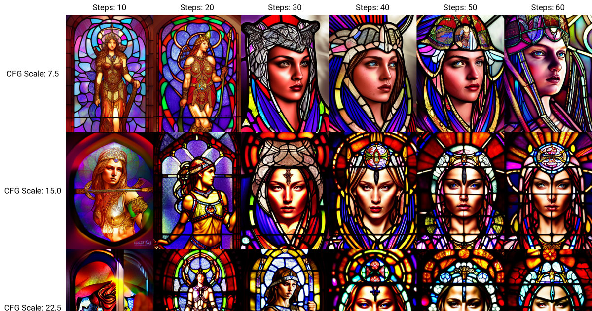

Stable Diffusion v1.4 - Steps, CFG scale, and Seed resize exploration - stain glass window of goddess warrior
=============================================================================================================

Visit:
https://przemoc.github.io/sd-v1-4-exploration-stain_glass_window_of_goddess_warrior/

Euler ancestral sampler results from sd-v1-4 for the same prompt and seed, but
different steps and CFG scale shown in X/Y plots per different seed resizing.

**Tool**:
[AUTOMATIC1111/stable-diffusion-webui](https://github.com/AUTOMATIC1111/stable-diffusion-webui/)

**Prompt**: stain glass window of goddess warrior, light shiny through,
intricate, elegant, highly detailed, digital painting, sharp focus, realistic,
hyperrealistic, cinematic, illustration  
(prompt taken from https://prompthero.com/prompt/f8c755d2482)

**Sampler**: Euler a  
**Seed**: 1089567288  
**Size**: 384x512  
**Steps**: 1-80  
**CFG scale**: 0.5-30.0 (+0.5)  

Web UI
------

To navigate through generated grids barebone web UI has been created.
Following keyboard shortcuts are supported:

<kbd>1</kbd>...<kbd>7</kbd> - change seed resize  
<kbd>R</kbd> - next seed resize  
<kbd>Shift</kbd>+<kbd>R</kbd> - previous seed resize  
<kbd>O</kbd> - next output  
<kbd>Shift</kbd>+<kbd>O</kbd> - previous output  
<kbd>P</kbd> - choose/recalc pixel zoom  
<kbd>Z</kbd> - next zoom  
<kbd>Shift</kbd>+<kbd>Z</kbd> - previous zoom  
<kbd>H</kbd> - hide/show non-dynamic part of the page  
<kbd>F</kbd> - request full-screen  

Resources used to generate full grid images
-------------------------------------------

**HW**:
NUC11PHKi7C002, Core i7-1165G7 @ 2.80GHz, Lexar 1x32GB DDR4-3200 CL22
(LD4AS032G-3200ST), PNY 2TB CS3040 (M280CS3040-2TB-RB), NVIDIA GeForce RTX 2060
Mobile @ 1005MHz 6GB (517.40)

**SW**: Windows 11 Pro (10.0.22621), WSL: Ubuntu 22.04.1

### Seed resize from: 384x512, 3072x4096, 4608x6144, 1152x1536, 768x1024, 1536x2048, 192x256

**SW**:
cuda-11-7, Python 3.8.5, PyTorch 1.11.0,
webui commit <= d62954c2bc149053f9f51dfe95751b9e0ea29f03

**Time**:
9:03:27 + 9:00:45 + 9:09:00 + 9:10:56 + 9:12:28 + 9:14:33 + 9:15:41
= 64h 06min 50sec

License
-------

CC0 1.0 Universal (CC0 1.0) Public Domain Dedication.
See [LICENSE.CC0](LICENSE.CC0) file for the full license text.
